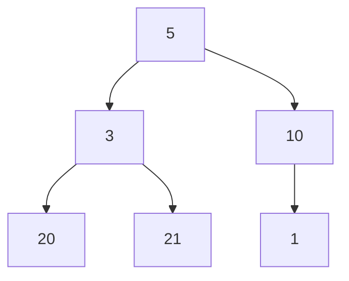

# Question 01

Given a binary tree, represented by pointer references,
find the height of a binary tree satisfying following constraints

The height of a binary tree is defined as the length of the longest possible path in the tree.

In particular, a tree consisting of only one node has height 0 and, conventionally, an empty tree has height −1.

For instance, the following tree has height of two.



```python
# input
(5, (3, (20, None, None), (21, None, None)), (10, (1, None, None), None))

# expected output
2

# sample python function signature
def solution (tree: tuple[int, tuple | None, tuple | None]) -> int:
  pass

```

# Question 02

Given a string representing an integer in its binary representation,
efficiently calculate the number of operations required to make it zero
consecutively performing below two steps

- if the value is even divide by two 
- else minus one from value

For instance, an input of `11011` which is equitant to $27_{10}$ should return `8` since it requires eight operations following above logic to make it zero; `27 -> 26 -> 13 -> 12 -> 6 -> 3 -> 2 -> 1 -> 0`

```
27
 └─ 27 - 1 -> 26
 └─ 26 / 2 -> 13
 └─ 13 - 1 -> 12
 └─ 12 / 2 -> 6
 └─ 6 / 2 -> 3
 └─ 3 - 1 -> 2
 └─ 2 / 2 -> 1
 └─ 1 - 1 -> 0

```

```python
# input
"11011"
 
# expected output
8

# sample python function signature
def solution (binaryStr: str) -> int:
  pass
```

# Question 03

Give a list of fuel stations, the maximum amount of fuel refill that can be
obtained from the respective fuel station, and the starting station index,
efficiently determine whether the traveler can traverse all rest of fuel stations without running out of fuel

Assumption;
  - the fuel list is circular; if started at last index traveller should wrap around to the begining and traverse till the started index
  - the traveller starts with zero fuel
  - fuel level should always remain > 0 throughout the traverse

```python
# input
[
  { "cost": 5, "refill": 1 },
  { "cost": 2, "refill": 5 },
  { "cost": 2, "refill": 3 },
  { "cost": 8, "refill": 3 },
  { "cost": 2, "refill": 5 },
  { "cost": 4, "refill": 3 },
  { "cost": 2, "refill": 1 },
  { "cost": 5, "refill": 4 },
  { "cost": 1, "refill": 4 },
  { "cost": 2, "refill": 5 }
], 4

# expected output
False
```

```python
# input
[
  { "cost": 5, "refill": 1 },
  { "cost": 2, "refill": 5 },
  { "cost": 2, "refill": 3 },
  { "cost": 8, "refill": 3 },
  { "cost": 2, "refill": 5 },
  { "cost": 4, "refill": 3 },
  { "cost": 2, "refill": 1 },
  { "cost": 5, "refill": 4 },
  { "cost": 1, "refill": 4 },
  { "cost": 2, "refill": 5 }
], 8

# expected output
True

# sample python function signature
def solution (fuel_stations: list[object], starting_index: int) -> bool:
  pass
```
